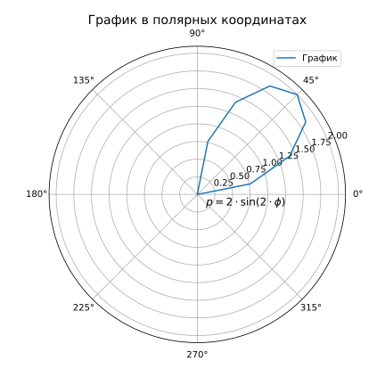

# Построение графиков с помощью библиотеки matplotlib

## Задания

**Первое задание**. Необходимо построить *параметрический* график функции на плоскости. Шаг использовать свой, а функции беруться по варианту:

```python
# Вариант 4.

x = cons(t) + t * sin(t)
y = sin(t) - t * cos(t)
```

**Второе задание**. Необходимо построить график полярных координат по заданным значениям. Мои значения:

```python
# Вариант 4.

p = 2 * sin(2 * fi) # 0 <= fi <= pi / 2
h = pi / 16
```

Обязательные поля:
- название
- основные линии сетки
- вспомогательные линии сетки
- график функции
- шкала по осям
- математическая запись функции

## Результат выполнения

**Задание 1.**


**Задание 2.**


